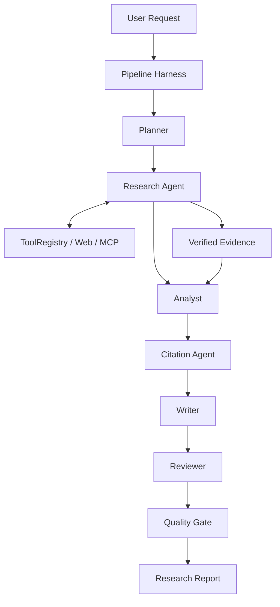

# Rivio · AI 竞品情报工作台

> 让每条结论都有证据，让每次研究都可追溯。

[](https://www.python.org/)
[](https://fastapi.tiangolo.com/)
[](https://docs.pydantic.dev/)
[](https://modelcontextprotocol.io/)

Rivio 是一个 **Evidence-first 的多 Agent 竞品情报系统**。  
它通过 Planner、Research、Analyst、Citation、Writer、Reviewer 等角色协作，自动完成研究规划、信息采集、证据验证、竞品分析与报告生成，并通过 `Source → Evidence → Claim → Report` 证据链保证最终结论可验证、可追溯。

- **不是“多个 Agent 一起写报告”**：Harness 负责控制流，Artifact / Handoff 负责数据流，Agent 只处理需要语义判断的任务。
- **不是“搜到什么就相信什么”**：Evidence 必须经过逐字引用、原文偏移与内容哈希校验，Claim 还要再次经过 Citation Check。
- **不是“无限自治”**：Research Agent 可以动态决策 Search / Fetch / Read / Submit / Finish，但始终受预算、状态与停止条件约束。

---

## ✨ 核心特性

| 能力 | 说明 |
|---|---|
| 🧠 多 Agent 编排 | Harness 驱动 Planner / Research / Analyst / Citation / Writer / Reviewer 分阶段协作 |
| 🔎 有界自主研究 | Research Agent 根据研究状态动态选择 Search、Fetch、Read、Evidence Submit、Finish |
| 🧭 Mission Coverage | 从全局观察 Evidence Coverage，并针对 ResearchGap 进行有限补采 |
| 📚 Evidence-first RAG | SourceChunk 切分 + BM25 默认检索，支持 FastEmbed / RRF / CrossEncoder 增强模式 |
| 🔗 证据全链路追溯 | `Source → SourceChunk → Evidence → Claim → Report` 可验证回溯 |
| ✅ 双层可靠性校验 | Evidence↔Source 做 Exact Quote 校验；Claim↔Evidence 做 Citation Check |
| 🧩 Structured Output | Pydantic Schema 校验 + 分阶段生成 + 有限重试 + Python 确定性组装 |
| 🛠️ ToolRegistry / MCP | 统一管理 Native / MCP 工具，并对补充来源做故障隔离 |
| ♻️ Checkpoint / Resume | 长任务状态持久化，支持检查点恢复与失败后继续执行 |
| 👀 Trace / SSE | 记录 AgentRun、ToolCall、Artifact、Handoff 等运行轨迹，并实时推送进度 |
| 🖥️ Agent Team Workspace | 实时展示 Agent Pipeline、Research Action、Evidence Library 与最终研究报告 |

---

## 🏗️ 系统架构



核心原则：

> **Harness 管控制流，Artifact 管数据流，Agent 负责语义决策。**

---

## 🔬 Evidence-first RAG

Rivio 的 RAG 主要用于**证据定位与验证**，而不是普通问答。

```text
Web Search / MCP
        ↓
SourceDocument
        ↓
SourceChunk
        ↓
Task-aware Retrieval
        ↓
Research Agent READ
        ↓
Exact Quote
        ↓
Verified Evidence
        ↓
Claim
        ↓
Citation Check
        ↓
Report
```

默认检索策略为 **BM25**；同时实现了：

- FastEmbed 语义召回
- RRF 融合
- CrossEncoder Rerank

离线回放中，Hybrid + Rerank 在检索质量上优于 BM25，但考虑 CPU 延迟与运行稳定性，当前默认仍采用 BM25。

| Retrieval | Recall@10 | MRR@10 | nDCG@10 |
|---|---:|---:|---:|
| BM25 | 84.5% | 63.6% | 69.0% |
| Hybrid + Rerank | **91.1%** | **78.6%** | **78.4%** |

> 以上结果来自历史 Research Task 的小规模离线回放，用于策略比较，不代表大规模线上生产指标。

---

## 🤖 Research Agent

Research Agent 不是固定 Workflow，而是一个受约束的 Agent Loop：

```text
SEARCH → FETCH → READ → SUBMIT_EVIDENCE → FINISH
```

LLM 根据当前研究状态动态决定下一步动作，确定性代码负责：

- Action 校验
- Query / Tool Budget
- Source / Chunk / Evidence ID 校验
- 停止条件
- 状态持久化
- 失败恢复

在 Mission 层，系统根据 Evidence Coverage 与 ResearchGap 判断是否需要补充研究任务，从而在研究深度、覆盖度与成本之间做平衡。

---

## 🔒 报告可靠性

Rivio 把“来源真实”和“结论有据”拆成两层：

```text
Evidence ↔ Source
Exact Quote / Offset / Content Hash

Claim ↔ Evidence
Citation Check
```

最终形成：

```text
Source → Evidence → Claim → Report
```

因此报告里的关键结论可以继续回溯到：

- 对应 Claim
- 支撑 Evidence
- SourceChunk 原文片段
- 原始 Source URL

未找到证据时，系统保留 ResearchGap / Uncertainty，而不是直接把“没找到”写成“事实不存在”。

---

## 🧠 Context Governance

Rivio 使用角色级 Context Builder，不把完整上游 Research Workspace 直接交给每个 Agent。

```text
Full Upstream Research Assets
            ↓
      Context Builder
            ↓
Brief / Assessment / Claims Context
```

在 3 个真实任务的离线 Replay 中，相比未筛选的上游研究上下文：

- Analyst 单次最大输入上下文降低约 **90%**
- Evidence 引用链保持完整

---

## 🖥️ Agent Team Workspace

前端已重构为三段式研究体验：

```text
Research Brief
      ↓
Agent Team Workspace
      ↓
Research Report
```

### Research Brief
用户通过自然语言输入研究需求，系统完成意图解析与研究目标确认。

### Agent Team Workspace
实时展示：

- Agent Pipeline
- 当前 Research Task
- Search / Fetch / Read / Evidence Submit 等公开 Action
- Evidence Library
- Evidence Chain
- Pipeline 进度与阶段状态

### Research Report
报告中的引用可以继续追溯到：

```text
Report → Claim → Evidence → SourceChunk → Source
```

原有工程视图保留为 Developer / Diagnostic Console，用于查看运行状态、Artifact、Trace 与质量治理信息。

---

## 🏗️ 技术栈

Python、FastAPI、Pydantic、JavaScript、Tool Calling、RAG、BM25/FastEmbed、MCP、SSE

---

## 📂 目录结构

```text
Rivio/
├── backend/
│   ├── app/
│   │   ├── agents/          # Planner / Analyst / Writer 等 Agent
│   │   ├── api/             # FastAPI API
│   │   ├── context/         # Role / Stage Context Builder
│   │   ├── execution/       # Research Agent / Mission / Analysis
│   │   ├── frameworks/      # Versioned Research Framework
│   │   ├── harness/         # Pipeline / Protocol / Artifact
│   │   ├── intake/          # Research Brief / Planning
│   │   ├── llm/             # LLM Client / Provider / Retry
│   │   ├── reporting/       # Report Generation
│   │   └── tools/           # ToolRegistry / Web / MCP
│   ├── check_*.py           # Regression / Contract Checks
│   └── run_*_eval.py        # Offline Evaluation
│
├── frontend/
│   ├── index.html
│   └── src/
│
└── docs/
```

---

## 🚀 快速开始

### 1. 克隆项目

```bash
git clone https://github.com/Q-Sophia/Rivio.git
cd Rivio
```

### 2. 安装后端依赖

```bash
cd backend
pip install -r requirements.txt
```

### 3. 配置环境变量

LLM、Web Search 与 MCP 凭据通过系统环境变量或本地 `.env` 注入。

真实 API Key 不应写入代码或提交到 Git。

### 4. 启动服务

```bash
python -m uvicorn app.api.main:app --host 127.0.0.1 --port 8001
```

然后通过浏览器访问前端页面。

---


## Repository

https://github.com/Q-Sophia/Rivio
