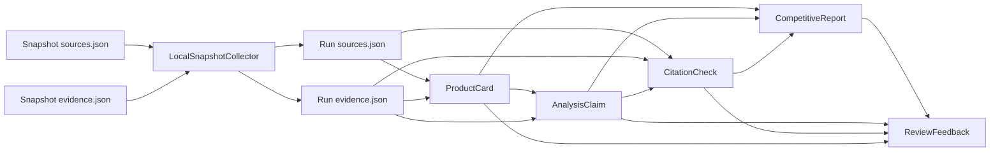
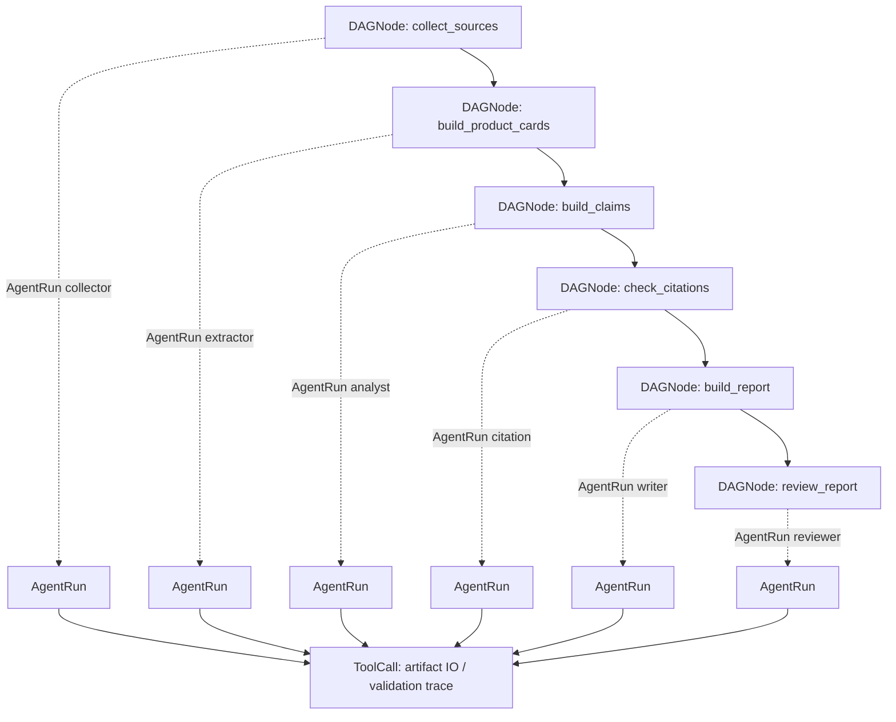

# Milestone 1-5 学习复盘

本文档用学习视角复盘当前系统已经实现的本地 Snapshot Agent Workflow。

当前阶段的核心目标不是做一个能聊天的应用，而是先把“竞品分析从证据到报告”的工程底座打稳：

```text
可追溯证据
  -> 结构化产品卡
  -> 可引用分析结论
  -> 引用校验
  -> 报告
  -> 审查反馈
  -> Agent workflow trace
```

当前仍然不接 LLM、不做爬虫、不做 FastAPI、不做前端。

## 1. 当前系统的数据流

业务证据链：



Workflow trace 链：



当前完整运行入口：

```text
run_snapshot_agent_workflow_demo.py
  -> collect_sources
  -> build_product_cards
  -> build_claims
  -> check_citations
  -> build_report
  -> review_report
```

独立校验入口：

```text
check_workflow_trace.py
check_run_artifacts.py
```

## 2. 每个 artifact 是怎么来的

当前默认输出目录：

```text
backend/app/data/runs/snapshot_online_education_demo/
```

### sources.json

来自：

```text
backend/app/data/snapshots/online_education/sources.json
```

生成步骤：

```text
LocalSnapshotCollector
  -> SourceDocument schema 校验
  -> ArtifactStore.save_many("sources")
```

作用：保存本次 run 使用过的来源页面，例如官网、产品页、GitHub、第三方文章。

### evidence.json

来自：

```text
backend/app/data/snapshots/online_education/evidence.json
```

生成步骤：

```text
LocalSnapshotCollector
  -> SourceEvidence schema 校验
  -> evidence.source_id 检查
  -> ArtifactStore.save_many("evidence")
```

作用：保存原子证据。每条 evidence 必须能通过 `source_id` 指回一个 source。

### product_cards.json

来自：

```text
sources.json + evidence.json
```

生成步骤：

```text
build_product_cards_demo.py
  -> 按 competitor 聚合 evidence
  -> 生成 ProductCard
  -> 检查 source_ids / evidence_ids 都真实存在
  -> ArtifactStore.save_many("product_cards")
```

作用：把一堆零散证据聚合成每个竞品的一张产品卡。

### claims.json

来自：

```text
product_cards.json + evidence.json
```

生成步骤：

```text
build_claims_demo.py
  -> 规则生成 AnalysisClaim
  -> 每条 claim 绑定 evidence_ids
  -> 不允许空 evidence claim
  -> ArtifactStore.save_many("claims")
```

作用：保存分析结论。它是报告中的“可引用观点”。

### citation_checks.json

来自：

```text
sources.json + evidence.json + claims.json
```

生成步骤：

```text
run_citation_check_demo.py
  -> 检查 claim.evidence_ids 是否存在
  -> 检查 evidence.source_id 是否存在
  -> 根据证据强弱标记 supported / weak / invalid
  -> ArtifactStore.save_many("citation_checks")
  -> 同步更新 claims.json 中的 citation_status
```

作用：回答“这条分析结论有没有证据支撑，证据强不强”。

### reports.json

来自：

```text
product_cards.json + claims.json + citation_checks.json + sources.json + evidence.json
```

生成步骤：

```text
build_report_demo.py
  -> 规则模板生成 CompetitiveReport
  -> markdown 中标注 claim id
  -> report.claim_ids 保存使用过的 claim
  -> ArtifactStore.save_many("reports")
```

作用：保存报告 artifact。报告不是凭空生成，而是引用 claim。

### review_feedback.json

来自：

```text
reports.json + claims.json + citation_checks.json + product_cards.json
```

生成步骤：

```text
run_review_demo.py
  -> 检查报告是否为空
  -> 检查 report.claim_ids 是否存在
  -> 检查 weak/missing/invalid citation
  -> 检查产品研发视角关键词
  -> 生成 ReviewFeedback / ReviewIssue
  -> ArtifactStore.save_many("review_feedback")
```

作用：保存审查结果，指出报告或证据链存在的问题。

### dag_nodes.json

来自：

```text
run_snapshot_agent_workflow_demo.py
```

生成步骤：

```text
DAGExecutor
  -> 固定 6 个 DAGNode
  -> 每个节点记录 status / started_at / completed_at / input_refs / output_refs
  -> ArtifactStore.save_many("dag_nodes")
```

作用：描述 workflow 的结构和每个节点状态。

### agent_runs.json

来自：

```text
DAGExecutor 执行每个 DAGNode
```

生成步骤：

```text
每个节点开始时创建 AgentRun
节点成功后写 output_summary / duration_ms
节点失败后写 error
ArtifactStore.save_many("agent_runs")
```

作用：记录每一步由哪个 Agent 角色执行、执行结果和耗时。

### tool_calls.json

来自：

```text
workflow 内部关键操作
```

当前记录的 tool_name：

```text
snapshot_collector.collect
artifact_store.load_many
artifact_store.save_many
artifact_validator.check_refs
```

作用：记录每个 AgentRun 内部做了哪些关键读写和校验动作。

### pipeline_summary.json

来自：

```text
workflow 结束后的 summary 汇总
```

作用：保存本次 pipeline 的总体运行结果，例如 artifact 数量、DAG 节点数量、AgentRun 数量、ToolCall 数量、supported/weak 数量、review 分数和 pipeline 状态。

## 3. 每个 schema 在流程里的作用

### SourceDocument

表示“来源页面”。

它回答：

```text
这条信息来自哪里？
来源是什么类型？
来源可信度大概怎样？
```

关键字段：

- `id`
- `title`
- `url`
- `source_type`
- `competitor`
- `reliability_score`

### SourceEvidence

表示“从来源里抽出来的一条原子证据”。

它回答：

```text
这条事实是什么？
它属于哪个竞品？
它属于哪个分析维度？
它能追溯到哪个 source？
```

关键字段：

- `source_id`
- `competitor`
- `dimension`
- `snippet`
- `normalized_fact`
- `confidence`

### ProductCard

表示“某个竞品的结构化产品画像”。

它回答：

```text
这个竞品是什么定位？
面向哪些用户？
有什么核心功能？
价格/商业模式是什么？
证据覆盖了哪些？
```

关键字段：

- `name`
- `positioning`
- `target_users`
- `pricing_summary`
- `core_features`
- `source_ids`
- `evidence_ids`

### AnalysisClaim

表示“可以放进报告里的分析结论”。

它回答：

```text
我们得出了什么判断？
这个判断属于什么维度？
它引用了哪些 evidence？
引用状态是什么？
```

关键字段：

- `dimension`
- `claim_text`
- `competitors`
- `evidence_ids`
- `citation_status`

### CitationCheck

表示“对 claim 的证据检查结果”。

它回答：

```text
claim 绑定的 evidence 存不存在？
evidence 能不能追溯到 source？
证据是 supported 还是 weak？
```

关键字段：

- `claim_id`
- `evidence_ids`
- `status`
- `message`

### CompetitiveReport

表示“报告产物”。

它回答：

```text
报告正文是什么？
报告使用了哪些 claim？
```

关键字段：

- `title`
- `markdown`
- `claim_ids`
- `sections`

### ReviewFeedback / ReviewIssue

表示“审查反馈”。

它回答：

```text
报告能不能通过？
有哪些问题？
问题严重程度是什么？
后续应该修什么？
```

关键字段：

- `overall_score`
- `approved`
- `issues`
- `suggestions`

### DAGNode

表示“工作流里的一个步骤节点”。

它回答：

```text
workflow 有哪些步骤？
步骤之间如何依赖？
每个步骤当前是什么状态？
这个步骤输入/输出哪些 artifact？
```

### AgentRun

表示“某个 Agent 角色执行某个 DAGNode 的一次运行记录”。

它回答：

```text
这一步是谁执行的？
什么时候开始？
什么时候结束？
耗时多久？
成功还是失败？
输出摘要是什么？
```

### ToolCall

表示“某个 AgentRun 内部的一次关键操作记录”。

它回答：

```text
这个 AgentRun 具体做了哪些读写/校验动作？
输入参数是什么？
输出摘要是什么？
是否成功？
```

当前 ToolCall 是内部工具调用 trace，不是外部 API 调用。

### PipelineSummary

表示“整次 workflow 的总览”。

它回答：

```text
这次 pipeline 最终产出了多少 artifact？
DAG 成功了吗？
review 通过了吗？
证据支持状态如何？
```

## 4. DAGNode / AgentRun / ToolCall 分别解决什么问题

### DAGNode 解决“流程结构可见”

没有 DAGNode 时，我们只知道脚本跑完了，但不知道 workflow 被拆成了哪些步骤。

DAGNode 让系统知道：

- 总共有 6 个步骤。
- 步骤顺序是什么。
- 每步依赖谁。
- 每步输入什么、输出什么。
- 每步状态是什么。

一句话：DAGNode 是 workflow 的“流程图节点”。

### AgentRun 解决“谁执行、执行得怎么样”

没有 AgentRun 时，我们看不到“哪个 Agent 角色完成了哪一步”。

AgentRun 让系统知道：

- collector 做了采集。
- extractor 做了产品卡。
- analyst 做了 claim。
- citation 做了引用检查。
- writer 做了报告。
- reviewer 做了审查。

一句话：AgentRun 是“角色执行记录”。

### ToolCall 解决“步骤内部做了什么”

没有 ToolCall 时，AgentRun 只能说“我完成了”，但不知道具体读写了哪些 artifact。

ToolCall 让系统知道：

- 是否调用了 snapshot collector。
- 是否读取了 sources/evidence。
- 是否保存了 product_cards/claims/reports。
- 是否做了引用校验。

一句话：ToolCall 是“步骤内部关键动作日志”。

三者合起来：

```text
DAGNode: 这一步在流程图里的位置
AgentRun: 哪个 Agent 执行了这一步
ToolCall: 这个 Agent 在这一步里做了哪些动作
```

## 5. 当前哪些是规则版

当前系统几乎所有“智能判断”都是规则版。

### ProductCard 是规则版

当前做法：

```text
按 competitor 分组 evidence
按 dimension 拼接 positioning / feature / pricing / ecosystem / risk
```

它不是模型理解出来的，而是规则聚合。

### AnalysisClaim 是规则版

当前 5 条 claim 是固定模板：

- positioning
- feature
- pricing
- ecosystem
- risk

每条 claim 绑定固定 evidence ids。

### CitationCheck 是规则版

当前检查逻辑：

- evidence_ids 为空 -> missing_evidence
- evidence_id 不存在 -> invalid_evidence
- source_id 不存在 -> invalid_evidence
- evidence confidence 或 source reliability 较低 -> weak
- 否则 -> supported

### CompetitiveReport 是规则版

当前报告是固定章节模板：

- 任务背景
- 竞品产品路线概览
- 功能基线观察
- 技术接入与生态分析
- 商业模式与成本结构
- 风险与限制
- 产品研发建议
- Claim 引用列表

### ReviewFeedback 是规则版

当前审查逻辑：

- markdown 是否为空
- claim_ids 是否为空
- claim_ids 是否存在
- 是否有 weak/missing/invalid citation
- 是否覆盖产品研发关键词
- 是否至少有 3 个 ProductCard

### Workflow 是规则版

当前 DAG 固定为 6 步，不会动态规划，不会并行。

## 6. 后面哪些地方会替换成 LLM

后面接 LLM 时，不应该替换掉 schema 和 ArtifactStore，而是替换“内容生成逻辑”。

### 可以替换 ProductCard 生成

现在：

```text
规则拼接 evidence
```

以后：

```text
LLM 读取 evidence
生成更准确的定位、目标用户、功能、优势、弱点
但必须输出 ProductCard schema
并必须引用 source_ids / evidence_ids
```

### 可以替换 AnalysisClaim 生成

现在：

```text
固定 5 条 claim
```

以后：

```text
LLM 根据 ProductCard + Evidence 生成更丰富 claim
但每条 claim 必须绑定 evidence_ids
不允许无证据 claim
```

### 可以替换 Report 生成

现在：

```text
固定模板报告
```

以后：

```text
LLM 写更自然、更完整的报告
但报告里的关键结论仍然要标 claim id
CompetitiveReport.claim_ids 必须完整
```

### 可以增强 ReviewFeedback

现在：

```text
规则检查
```

以后：

```text
LLM 做更接近人工 reviewer 的质量审查
但 citation status、断链检查、schema 检查仍应保留规则校验
```

### 可以增强 DAG 规划

现在：

```text
固定 6 步顺序 DAG
```

以后：

```text
LLM/Orchestrator 根据任务动态规划 DAG
但 DAGNode / AgentRun / ToolCall trace 仍要保留
```

## 7. 当前系统和普通 RAG 问答系统有什么区别

普通 RAG 问答系统通常是：

```text
用户问题
  -> 检索相关文档片段
  -> LLM 直接生成回答
```

它的重点是“问答体验”。

当前系统是：

```text
SourceDocument
  -> SourceEvidence
  -> ProductCard
  -> AnalysisClaim
  -> CitationCheck
  -> CompetitiveReport
  -> ReviewFeedback
  -> DAG / Agent / Tool trace
```

它的重点是“可追溯的竞品分析工作流”。

主要区别：

| 维度 | 普通 RAG 问答 | 当前系统 |
|---|---|---|
| 目标 | 回答用户问题 | 生成可审查的竞品分析产物 |
| 中间产物 | 通常较少，可能只有 retrieved chunks | 明确保存 sources/evidence/cards/claims/checks/report/review |
| 证据链 | 可能只在回答里附引用 | 每个 claim 必须绑定 evidence_ids |
| 审查 | 通常没有独立 review artifact | 有 CitationCheck 和 ReviewFeedback |
| 可复现 | 依赖检索结果和 prompt | 每一步 artifact 可落盘、可重跑、可校验 |
| 工作流 | 通常是检索 + 生成 | 多步骤 pipeline + Agent trace |
| 前端可展示内容 | 问答和引用 | DAG、AgentRun、ToolCall、证据链、报告、审查问题 |

简单说：

```text
RAG 更像“带资料的问答”。
当前系统更像“有证据、有流程、有审查的分析生产线”。
```

## 8. 当前系统和 competitive-analysis-agent-main 的区别

`competitive-analysis-agent-main` 是领域原型参考。

它更像一个竞品分析产品 Demo，重点是：

- 用户输入需求
- Agent 分工
- 生成报告
- 前端展示
- 演示体验

当前 `competitive-intel-agents` 更像可信分析底座，重点是：

- schema 主证据链
- ArtifactStore
- citation check
- review feedback
- pipeline validation
- DAGNode / AgentRun / ToolCall trace

对比：

| 维度 | competitive-analysis-agent-main | competitive-intel-agents 当前系统 |
|---|---|---|
| 定位 | 领域产品原型 / demo | evidence-first 分析工作流底座 |
| 当前重点 | 应用体验、Agent 协作、报告展示 | 证据链、artifact、校验、trace |
| 报告生成 | 更偏最终展示 | 报告是 claim 的下游 artifact |
| 证据管理 | 不是当前主线 | 是主线 |
| 审查反馈 | 相对弱 | 独立 CitationCheck + ReviewFeedback |
| 可观测性 | 有 demo trace 思路 | 明确 DAGNode / AgentRun / ToolCall |
| 当前是否接 LLM | 更贴近 LLM Agent 应用 | 当前仍然纯规则版 |
| 当前是否前端优先 | 是重要组成 | 暂不做，先稳定后端 artifact |

它们的关系不是替代，而是分层参考：

```text
competitive-analysis-agent-main
  -> 借鉴产品形态、报告结构、Agent 分工、前端展示

learn-claude-code-main
  -> 借鉴 harness、agent loop、task trace、tool boundary

competitive-intel-agents
  -> 在上述参考基础上构建 evidence-first competitive intelligence workflow
```

未来理想形态是：

```text
外层体验像 competitive-analysis-agent-main：
  用户输入需求 -> Agent 协作 -> 报告 -> 前端展示

内层底座是我们当前做的东西：
  evidence chain -> citation check -> review -> artifact validation -> workflow trace
```

## 当前 Milestone 1-5 的学习结论

Milestone 1-5 的重点不是“让系统变聪明”，而是让系统变得：

- 可追溯
- 可复现
- 可校验
- 可审查
- 可观察

现在系统已经具备一个可信分析系统的骨架：

```text
数据有来源
证据可追溯
结论有引用
报告有 claim
审查能指出弱点
workflow 能显示每一步由谁执行
validation 能独立检查链路是否断裂
```

后续接 LLM、做前端、做实时 Agent 协作时，才不会变成“模型直接写一篇漂亮但不可审查的报告”。
